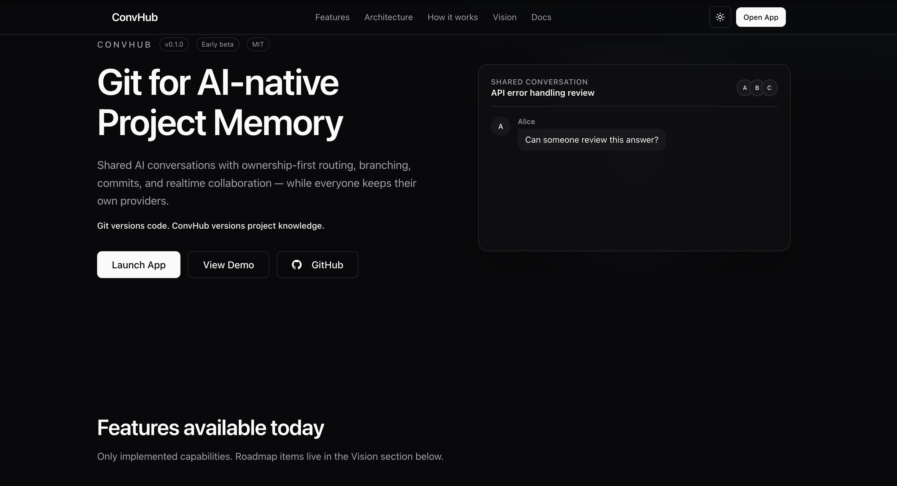

# ConvHub

**Git for AI-native Project Memory.**

[](LICENSE)
[](roadmap.md)
[](#implemented-today)

> Git versions code. ConvHub versions knowledge.

<!-- Screenshot placeholder: Landing page -->
<!--  -->

## Vision

Git stores files, commits, and branches — the history of *code*.

ConvHub aims to store conversations, commits, branches, architecture decisions, provider ownership, and collaboration history — the history of *project understanding*.

That long-term direction is real. **What ships today** is the collaborative foundation below — not Context Packages, Git linkage, or IDE extensions.

## Why ConvHub

- **AI chats disappear** — browser tabs and vendor UIs are not durable team memory.
- **People leave teams** — decisions leave with them.
- **Context is lost** — the next developer restarts from zero.
- **Git stores files, not decisions** — architecture choices live in chat, not in `git log`.

ConvHub keeps AI collaboration versioned and shareable — while every developer keeps ownership of their own AI providers.

## Implemented today

Only features that exist in the current codebase:

- Multi-provider AI routing (Anthropic, OpenAI, Gemini, Groq, Ollama, Mock)
- Ownership-first provider routing
- Borrowing engine between conversation participants
- Workspace collaboration and permissions
- Conversation branching
- Conversation commits and automatic checkpoints
- Branch visualization (manager, commit graph, overview)
- Realtime collaboration (WebSockets, streaming, presence)
- Budget management and credit ledger
- Message, commit, and lineage history
- Open source (MIT)

### How it works today

```
Create Workspace
        ↓
Invite Team Members
        ↓
Connect AI Providers
        ↓
Start Shared Conversations
        ↓
Branch Conversations
        ↓
Commit Important Milestones
        ↓
Continue Collaborating
```

## Architecture (implemented)

```
Developer
    ↓
ConvHub
    ↓
AI Providers
```

| Layer | Role |
|-------|------|
| **Developer** | Creates workspaces, invites teammates, connects providers, chats, branches, commits. |
| **ConvHub** | Shared conversations, ownership-first routing, borrowing, budgets, commits, branches, realtime. |
| **AI Providers** | Claude, OpenAI, Gemini, Groq, Ollama — each user owns their accounts. |

Inside ConvHub today:

```
Workspace → Conversation
              ├── Messages (working directory)
              ├── Checkpoints (automatic)
              ├── Commits (manual milestones)
              └── Branches (lineage)
```

**Planned (not implemented):** Git repository linkage, Context Packages, VS Code extension.

See [docs/architecture/](docs/architecture/) for diagrams and ADRs.

## Screenshots

| Screen | Placeholder |
|--------|-------------|
| Landing | `docs/images/landing.png` |
| Conversation | `docs/images/conversation.png` |
| Branching | `docs/images/branching.png` |
| Commit graph | `docs/images/commit-graph.png` |
| Dashboard | `docs/images/dashboard.png` |
| Providers | `docs/images/providers.png` |

## Development

### Prerequisites

- Docker & Docker Compose
- Node.js 20+ (for frontend development)

### 1. Clone and configure

```bash
git clone https://github.com/utkarsh-rusty/convhub.git
cd convhub
cp backend/.env.example backend/.env
```

### 2. Start backend and database

```bash
docker compose up --build
```

API docs: http://localhost:8000/docs

### 3. Run migrations (first time)

```bash
docker compose exec backend alembic upgrade head
```

### 4. Start frontend

```bash
cd frontend
npm install
npm run dev
```

App: http://localhost:5173

### Demo mode

```env
# backend/.env
DEMO_MODE=true
```

```bash
cd backend && PYTHONPATH=.. python ../scripts/seed_demo.py
docker compose up -d --force-recreate backend
```

On the login page: **Continue as Alice / Bob / Charlie**.

### Testing

```bash
cd backend
python -m pytest
```

```bash
cd frontend
npm run build
npm run lint
```

## Roadmap

Future work is **not** implemented. Categories:

| Status | Meaning |
|--------|---------|
| **Implemented** | Available now |
| **In Progress** | Actively being built |
| **Planned** | Intended for a named release |
| **Research** | Exploratory |

| Version | Focus | Status |
|---------|--------|--------|
| **v1.0** | Workspace, routing, borrowing, branching, commits, visualization, realtime, budgets | Implemented |
| **v1.1** | Project memory, context packages, restore, decision tracking, timeline | Planned |
| **v1.2** | Projects, Git metadata, Git linkage | Planned |
| **v1.3** | VS Code extension, push/pull context, Git sync | Planned |
| **v1.4** | Claude Code / Cursor / Codex / Continue adapters | Planned |
| **v2.0** | Semantic restore, conversation merge, knowledge graph | Research |

See [roadmap.md](roadmap.md) for the full breakdown.

## Contributing

Contributions are welcome. ConvHub is in **early beta**.

See [CONTRIBUTING.md](CONTRIBUTING.md).

## License

MIT — see [LICENSE](LICENSE).
