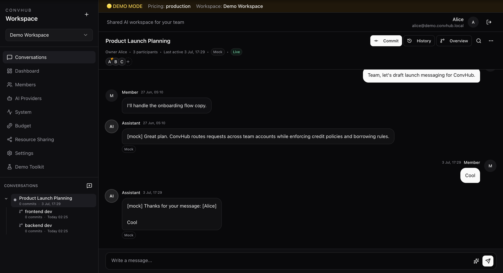
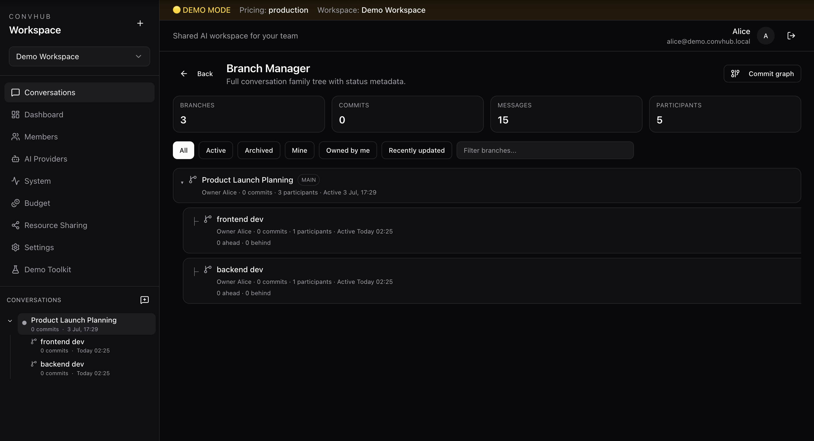
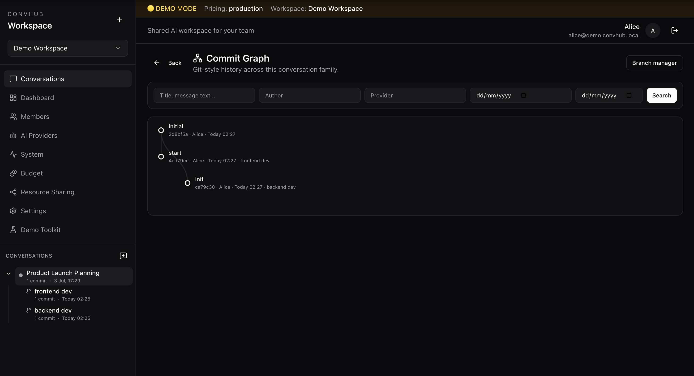
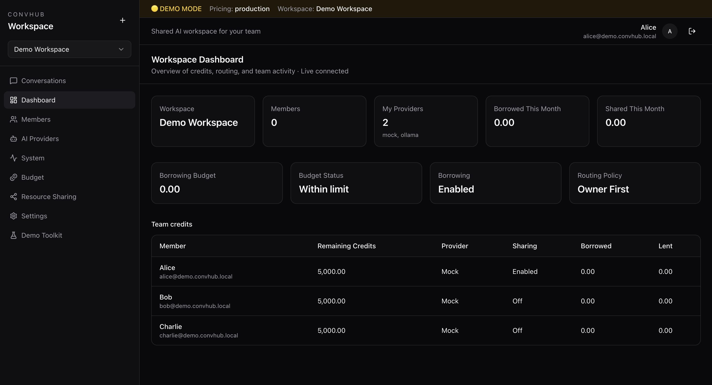
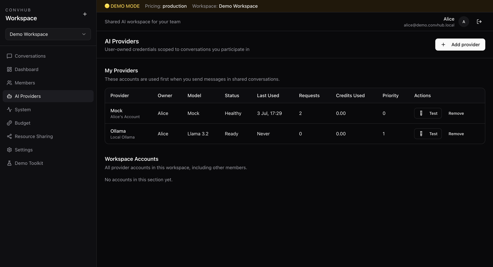

# ConvHub

**Git changed how developers collaborate on code.  
ConvHub changes how developers collaborate with AI.**

[](LICENSE)
[](KNOWN_LIMITATIONS.md)
[](#installation)

> Continue your teammate's AI coding session — with Git-style push and pull for AI context.


<!-- Screenshot: full landing hero. Caption: “ConvHub landing — continue a teammate’s AI session.” -->

---

## The Problem

Alice spends the day building in Claude Code. Decisions, dead ends, and working context live in that session — not in Git.

Tomorrow Bob needs to continue.

Without ConvHub, Bob usually has to:

- dig through Git history
- skim Slack and Notion
- ping Alice
- reconstruct what the AI already knew

That friction is the tax of AI-assisted teamwork.

**ConvHub removes it.**

---

## The Solution

Keep using Git for code. Use ConvHub for AI collaboration context.

```text
git push
convhub push

git pull
convhub pull
```

Then open a fresh Claude Code session, paste the handoff document, and continue.

No clipboard automation. No prompt injection. No replacing Claude Code or Git — just a clean handoff.

---

## Key Features

### AI Collaboration

Shared conversations with realtime streaming, presence, and multi-provider routing — while every developer keeps ownership of their own API keys.

**Why:** Teams should not fragment into private AI tabs.

### Workspaces & Projects

Workspaces for members and roles. Projects as the permanent home for conversations and memory.

**Why:** Collaboration needs a durable container, not a chat URL.

### Conversation Branching

Branch from any message. Explore alternatives without rewriting the main thread.

**Why:** Ideas fork. Memory should fork with them.

### Commits & Context Packages

Manual commits with Git-like hashes. Immutable Context Packages per commit. Restore into a new working conversation.

**Why:** Milestones should be findable and reusable.

### Repository Memory

Deterministic project-state memory for a coding repository branch — composed from ConvHub data, not LLM summaries.

**Why:** The next developer needs the current project picture, not a chat dump.

### Coding Workspaces

Link repositories and branches, sync metadata, track active developers, and keep coding conversations attached to repos.

**Why:** AI work sits next to code; ConvHub should know which repo and branch.

### Claude Code Integration

Official Claude Code hooks synchronize transcript deltas. CLI commands complete the loop:

- `convhub push` — upload pending transcript and verify ConvHub artifacts
- `convhub pull` — download a paste-ready Claude Handoff document

**Why:** Handoff should be a command, not a scavenger hunt.

### AI Handoff

A Claude-specific Markdown document composed from Pull Package data — repository memory, latest commit, context package, transcript snapshot, sync status, and static continue instructions.

**Why:** A new session needs a deterministic brief, not a paraphrase.

### Context Restore

Restore a Context Package into a new conversation and keep working from that checkpoint.

**Why:** Project memory should be reloadable, not trapped in an old thread.

---

## How It Works

```text
Admin creates workspace
        ↓
Creates project
        ↓
Invites developers
        ↓
Developer A works (chat and/or Claude Code)
        ↓
convhub push
        ↓
Developer B
        ↓
git pull
convhub pull
        ↓
Paste handoff into a new Claude Code session
        ↓
Continue seamlessly
```

Inside ConvHub, the same team can also branch conversations, commit milestones, inspect graphs, and restore packages — with budgets and borrowing when someone needs another participant’s provider.

---

## Screenshots

| Preview | Caption |
|---------|---------|
|  | Landing — product promise and workflow |
|  | Shared conversation with realtime streaming |
|  | Conversation branching and lineage |
|  | Commit graph across a conversation family |
|  | Projects and recent conversations |
|  | Owned AI providers and routing |
|  | *(placeholder)* Repository page — memory, pull package, Claude handoff |
|  | *(placeholder)* Claude Handoff preview / downloaded markdown |

---

## Installation

### Prerequisites

- Docker & Docker Compose
- Node.js 20+ (frontend)
- Python 3.12+ (plugin / local backend tests)
- Claude Code (optional — for the plugin)

### 1. Clone and configure

```bash
git clone https://github.com/utkarsh-rusty/convhub.git
cd convhub
cp backend/.env.example backend/.env
```

Set strong values for `JWT_SECRET_KEY` and `CREDENTIALS_ENCRYPTION_KEY` before any shared deploy.

### 2. Backend & database

```bash
docker compose up --build
docker compose exec backend alembic upgrade head
```

API: http://localhost:8000  
OpenAPI (debug): http://localhost:8000/docs

### 3. Frontend

```bash
cd frontend
npm install
npm run dev
```

App: http://localhost:5173

Optional: `VITE_API_URL=http://localhost:8000/api/v1`

### 4. Demo mode (optional)

```env
# backend/.env
DEMO_MODE=true
```

```bash
cd backend && PYTHONPATH=.. python ../scripts/seed_demo.py
docker compose up -d --force-recreate backend
```

Login page: **Continue as Alice / Bob / Charlie**.

---

## Plugin Guide

The ConvHub Claude plugin lives in [`plugins/claude/`](plugins/claude/README.md).

### Install

```bash
cd plugins/claude
chmod +x install.sh uninstall.sh convhub
./install.sh
```

Registers Claude Code hooks and links `convhub` to `~/.local/bin/convhub`.

### Configure

Edit `~/.convhub/config.json`:

```json
{
  "server_url": "http://localhost:8000/api/v1",
  "api_token": "<access_token>",
  "workspace_id": "<workspace_uuid>",
  "repository_id": "<repository_uuid>",
  "repository_branch_id": "<repository_branch_uuid>",
  "conversation_id": null
}
```

Replace every `REPLACE_WITH_*` placeholder from the starter file.

### Commands

```bash
convhub push
```

Flushes transcript deltas, verifies the External AI Session, and refreshes composed artifacts (Repository Memory, Pull Package, Claude Handoff).

```bash
convhub pull
```

Downloads Claude Handoff Markdown to `~/Downloads/convhub-handoff.md` (or `CONVHUB_DOWNLOAD_DIR`).

Then: open a **new** Claude Code session and paste the document. ConvHub does not paste for you.

### Uninstall

```bash
./uninstall.sh
```

Removes hooks and the CLI symlink. Does not delete `~/.convhub/`.

### Troubleshooting

| Symptom | Check |
|---------|--------|
| Hooks never sync | Confirm install merged into `~/.claude/settings.json`; restart Claude Code |
| `Push failed` / 401 | Refresh `api_token`; confirm `workspace_id` |
| 404 on repository | Confirm `repository_id` and `repository_branch_id` |
| No transcript upload | Ensure a session started (hooks or prior push); Confirm Stop/`push` after tool use |
| Empty handoff | Create branch memory / commits / external session activity first |
| `convhub: command not found` | Add `~/.local/bin` to `PATH`, or run `plugins/claude/convhub` directly |

Full detail: [plugins/claude/README.md](plugins/claude/README.md).

---

## Architecture

```text
Developer
    ↓
ConvHub (workspaces, projects, conversations, repos, memory, handoff)
    ↓
AI Providers (owned by each developer)
```

```text
Workspace → Projects → Conversations / Repositories
                              ↓
                    Commits → Context Packages
                    Branches → Repository Memory → Pull Package → Claude Handoff
```

Deep dives: [`docs/`](docs/index.md) · [Architecture overview](docs/architecture/architecture-overview.md) · [Known limitations](KNOWN_LIMITATIONS.md)

---

## Roadmap

### Complete — MVP v1 (through Sprint 36)

- Auth, workspaces, projects, realtime collaboration
- Ownership-first routing, borrowing, budgets
- Conversation branching, commits, Context Packages, restore
- Branch visualization
- Coding repositories, sync metadata, workspace sessions
- Repository Memory, External AI Sessions, Transcript Snapshots
- Pull Package, Claude Handoff adapter
- Claude Code plugin (hooks + `convhub push` / `convhub pull`)

### Future

| Area | Direction |
|------|-----------|
| Codex / Gemini / Cursor adapters | More IDE/CLI handoff targets |
| VS Code extension | In-editor push/pull context |
| AI summaries | Optional LLM digests (not required for handoff today) |
| Git automation | Remote Git operations beyond ConvHub repo metadata |
| Enterprise | SSO, stronger multi-tenant ops, rate limits at scale |
| Research | Semantic restore, conversation merge, knowledge graph |

See [roadmap.md](roadmap.md).

---

## FAQ

**What providers are supported?**  
Anthropic, OpenAI, Gemini, Groq, Ollama, and Mock — via accounts each user owns.

**Does ConvHub replace Git?**  
No. Git versions code. ConvHub versions AI collaboration context and project memory.

**Does ConvHub replace Claude Code?**  
No. The plugin observes Claude Code and produces a handoff you paste into a new session.

**Does ConvHub automate Git?**  
No. Run `git push` / `git pull` yourself. ConvHub’s push/pull is for AI context.

**How does AI Handoff work?**  
`convhub pull` downloads a deterministic Markdown brief from ConvHub. Paste it into a fresh Claude Code session and continue.

**Is transcript content summarized by AI?**  
No. Snapshots and handoffs are assembled/formatted, not summarized.

**Where are beta limits documented?**  
[KNOWN_LIMITATIONS.md](KNOWN_LIMITATIONS.md) · [QA_REPORT.md](QA_REPORT.md)

---

## Testing

```bash
cd backend && PYTHONPATH=. python -m pytest -q
cd plugins/claude && python -m pytest tests -q
cd frontend && npm run lint && npm run build
```

---

## Contributing

ConvHub is early beta. See [CONTRIBUTING.md](CONTRIBUTING.md).

Please keep docs accurate to **implemented** MVP behavior. Use `docs/` for deep technical material.

---

## License

MIT — see [LICENSE](LICENSE).
