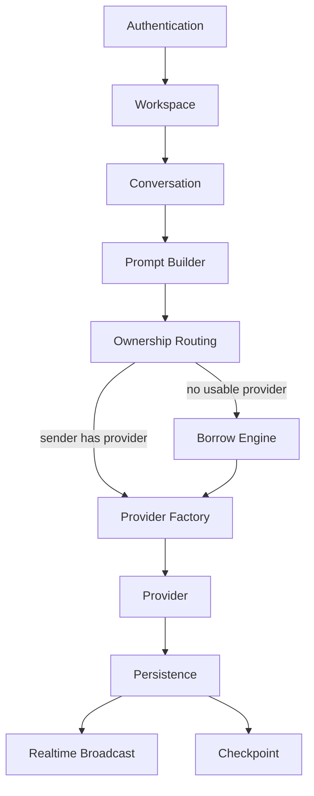

# Architecture Overview

ConvHub is **Git for AI-native Project Memory** — a collaborative system that versions conversations, commits, and branches while each participant keeps ownership of their own AI providers.

## High-level layers (implemented)

```
Developer
    ↓
ConvHub
    ↓
AI Providers
```

| Layer | Status | Role |
|-------|--------|------|
| Developer | **Implemented** | Works in workspaces, conversations, commits, and branches |
| ConvHub | **Implemented** | Memory primitives, routing, borrowing, budgets, realtime |
| AI Providers | **Implemented** | Claude, OpenAI, Gemini, Groq, Ollama, Mock |

**Planned (not implemented):** Git repository linkage — see [git-integration.md](git-integration.md).

## Request flow (implemented)

```
Authentication
        ↓
Workspace
        ↓
Conversation
        ↓
Prompt Builder
        ↓
Ownership Routing
        ↓
Borrow Engine (only when needed)
        ↓
Provider Factory
        ↓
Provider
        ↓
Persistence (+ checkpoint)
        ↓
Realtime
```



## Memory model (implemented)

```
Conversation
  ├── Messages
  ├── Checkpoints (automatic)
  ├── Commits (manual)
  └── Branches
```

## Planned / Research (not implemented)

| Component | Status |
|-----------|--------|
| Context Packages | Planned |
| Context Restore | Planned |
| Git Integration | Planned |
| VS Code Extension | Planned |
| IDE adapters | Planned |
| Conversation Merge | Research |
| Knowledge Graph | Research |

See [project-memory.md](project-memory.md) and [roadmap.md](../../roadmap.md).
