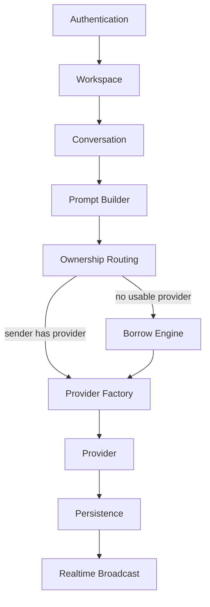

# Architecture Overview

ConvHub is **GitHub for AI Conversations** — a collaborative workspace where teams share conversation threads while each participant keeps ownership of their own AI providers.

## Request flow

```
Authentication
        ↓
Workspace
        ↓
Conversation
        ↓
Prompt Builder
        ↓
Ownership Routing
        ↓
Borrow Engine
        ↓
Provider Factory
        ↓
Provider
        ↓
Persistence
        ↓
Realtime
```



## Layers

### Authentication

JWT-based sign-in. Every API and WebSocket request is tied to an authenticated user.

### Workspace

The team boundary: members, roles, budgets, routing policy, and lending preferences.

### Conversation

A shared thread with participants, messages, and permissions. All AI requests are scoped to a conversation.

### Prompt Builder

Assembles conversation history, system context, and workspace policy into a provider-ready prompt.

### Ownership Routing

When a user sends a message, ConvHub routes through **that user's** AI accounts first. Provider selection respects routing policy, account health, and budget settings.

### Borrow Engine

If the sender has no usable provider, ConvHub looks for an eligible **conversation participant** who opted into auto-share with remaining credits. Borrowing never leaves the conversation.

### Provider Factory

A single abstraction over Anthropic, OpenAI, Gemini, Groq, Ollama, and Mock — so conversations are not locked to one vendor.

### Provider

Executes the LLM call and streams tokens back to the gateway.

### Persistence

Messages, AI requests, execution metadata, credit transactions, and borrow records are stored in PostgreSQL.

### Realtime

WebSockets broadcast new messages, streaming tokens, presence, typing indicators, credit updates, and routing events to connected clients.

## Related documents

- [Architecture index](README.md)
- [AI account ownership](ai-account-ownership.md)
- [ADR-010: Ownership-first routing](ADR-010-ownership-first-routing.md)
- [ADR-009: Resource sharing](ADR-009-resource-sharing.md)
- [Realtime events](realtime-events.md)
