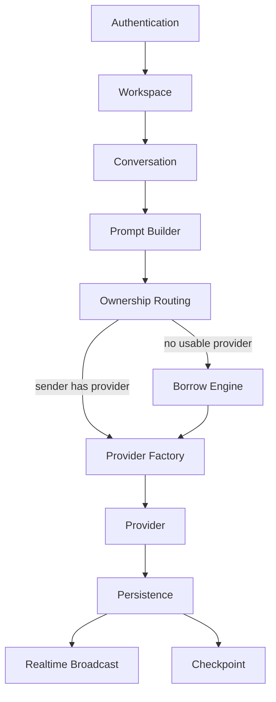

# Architecture Overview

ConvHub is a collaborative system for AI-assisted software development: teams share conversations and project memory while each participant keeps ownership of their own AI providers. Coding workspaces add repository-linked memory and Claude Code handoff.

## High-level layers (implemented)

```
Developer
    ↓
ConvHub
    ↓
AI Providers
```

| Layer | Status | Role |
|-------|--------|------|
| Developer | **Implemented** | Works in workspaces, conversations, coding repos, commits, branches, and Claude plugin |
| ConvHub | **Implemented** | Memory primitives, routing, borrowing, budgets, realtime, repository memory, handoff |
| AI Providers | **Implemented** | Claude, OpenAI, Gemini, Groq, Ollama, Mock |

**Also implemented:** repository metadata linkage, Repository Memory, External AI Sessions, Pull Package, Claude Handoff, Claude Code plugin (`convhub push` / `convhub pull`).

**Still planned:** remote Git automation and additional IDE adapters — see [git-integration.md](git-integration.md) and [roadmap.md](../../roadmap.md).

## Request flow (implemented)

```
Authentication
        ↓
Workspace
        ↓
Conversation
        ↓
Prompt Builder
        ↓
Ownership Routing
        ↓
Borrow Engine (only when needed)
        ↓
Provider Factory
        ↓
Provider
        ↓
Persistence (+ checkpoint)
        ↓
Realtime
```



## Memory model (implemented)

```
Conversation
  ├── Messages
  ├── Checkpoints (automatic)
  ├── Commits (manual)
  │     └── Context Packages
  └── Branches

Repository Branch
  ├── Repository Memory
  ├── External AI Sessions → Transcript Snapshots
  ├── Pull Package
  └── Claude Handoff
```

## Coding handoff flow (implemented)

```
Claude Code (hooks)
        ↓
External AI Session + transcript deltas
        ↓
Repository Memory / Pull Package
        ↓
convhub push  →  verify artifacts
convhub pull  →  Claude Handoff Markdown
        ↓
Paste into a new Claude Code session
```

## Planned / Research (not implemented)

| Component | Status |
|-----------|--------|
| Decision Tracking / richer memory timeline | Planned |
| Optional AI summaries | Planned |
| VS Code Extension | Planned |
| Codex / Gemini / Cursor adapters | Planned |
| Remote Git automation | Planned |
| Conversation Merge | Research |
| Knowledge Graph | Research |

See [coding-workspaces.md](coding-workspaces.md), [project-memory.md](project-memory.md), and [roadmap.md](../../roadmap.md).
