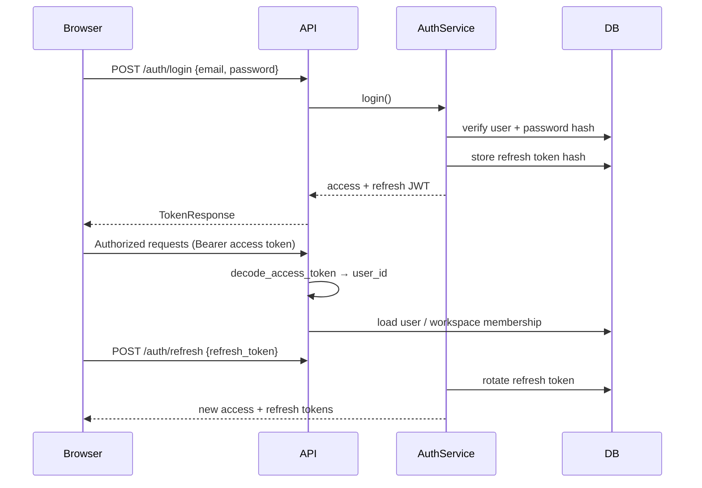

# Authentication Flow

## Demo mode (optional)

When `DEMO_MODE=true`:

- `GET /demo/users` lists Alice, Bob, Charlie personas.
- `POST /demo/login {persona}` issues tokens via the standard `AuthService.login` path using seeded credentials.
- Demo endpoints return **404** when demo mode is disabled.

No changes to production auth when demo mode is off.
