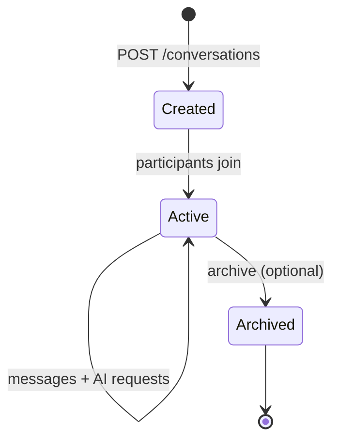

# Conversation Lifecycle

## Message flow

1. User sends message → `POST /conversations/{id}/messages` or `/chat/send`.
2. `ConversationService.create_message` persists user message.
3. Realtime broadcaster emits `message.created` to subscribers.
4. `AIGateway` routes provider, enforces credits, streams assistant reply.
5. Assistant message persisted; `message.completed` broadcast.

## Realtime

Clients subscribe to workspace + conversation channels over WebSocket (`/api/v1/realtime/ws`).
