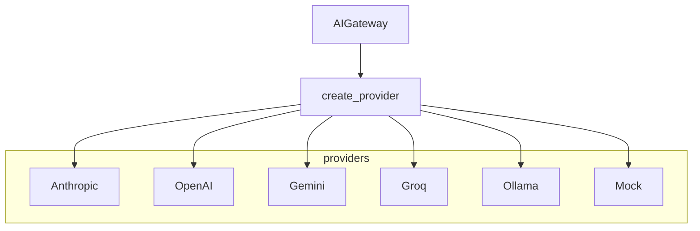

# Provider Abstraction

## Interface

All providers implement `AIProvider`:

- `generate(prompt_context, model) -> AIResponse`
- Optional `stream_events()` when `supports_streaming` is true

## Workspace credentials

AI accounts store encrypted API keys per workspace. The routing engine selects an account; the factory instantiates the matching provider.

## Development fallbacks

In `APP_ENV=development`, env keys (`ANTHROPIC_API_KEY`, `OPENAI_API_KEY`, …) can backfill missing workspace credentials for local testing.

See [ADR-005-prompt-builder.md](ADR-005-prompt-builder.md) for prompt construction.
