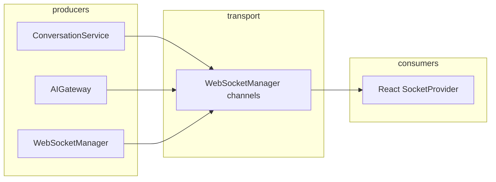

# Realtime Events

## Event envelope

Every event includes:

- `type` — e.g. `message.created`, `typing.started`, `credits.updated`
- `timestamp`
- `workspace_id`
- `conversation_id` (nullable)
- `payload`

## Channels

- **Workspace** — presence, credits, routing, conversation list invalidation
- **Conversation** — messages, typing, streaming tokens
- **User** — direct notifications (when used)

See `app/realtime/events.py` for the full enum.
