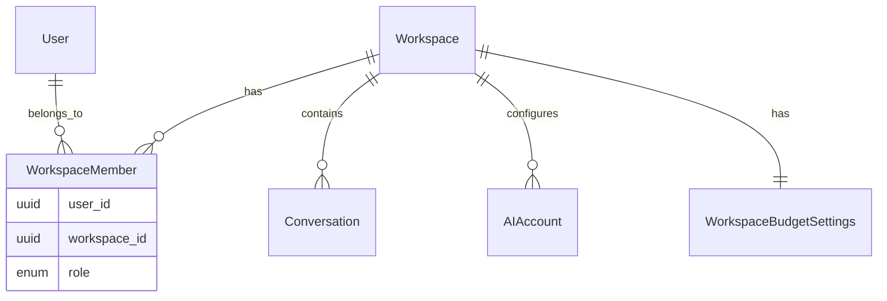

# Workspace Model

## Roles

| Role | Capabilities |
|------|------------|
| Owner | Full control, billing settings, delete workspace |
| Admin | Members, AI providers, routing, system health |
| Member | Conversations, own budget, sharing preferences |

## Context

Every authenticated workspace request includes `X-Workspace-ID`. Dependencies resolve `WorkspaceContext` (user + membership) before business logic runs.
